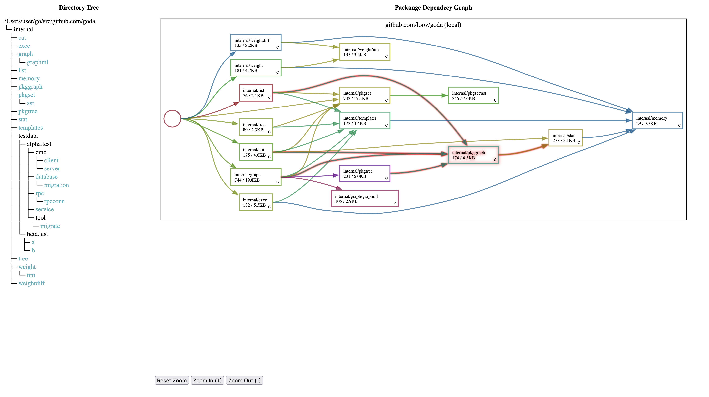

# go-codevis

Visuzlize go application source code.

Example `github.com/loov/goda`:


## Usage
Install:
```bash
go install github.com/alexuserid/go-codevis
```

Usage:
```bash
cd ~/go/src/github.com/my-go-repository
go-codevis
```
